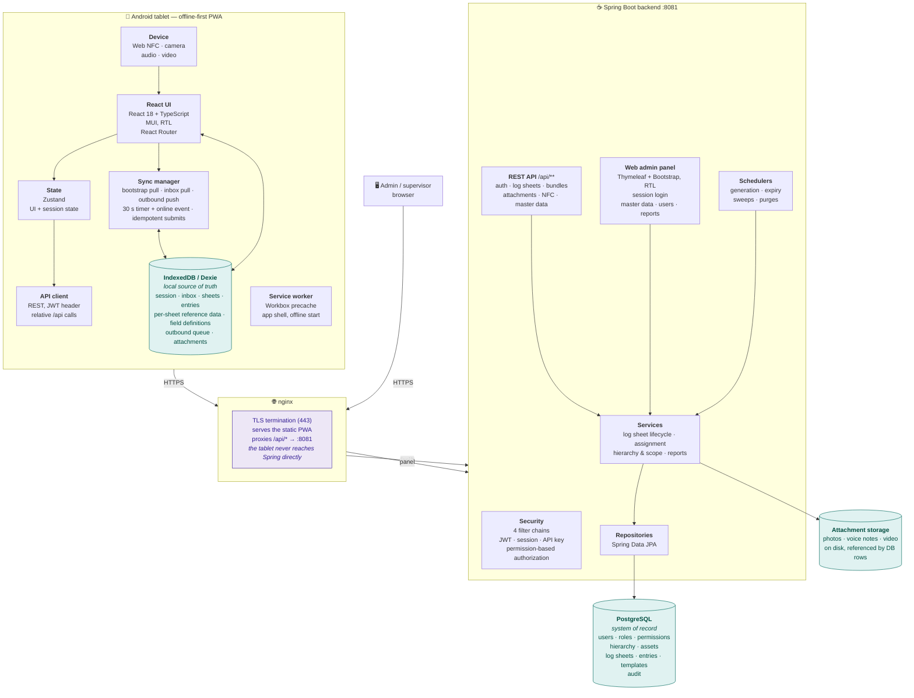
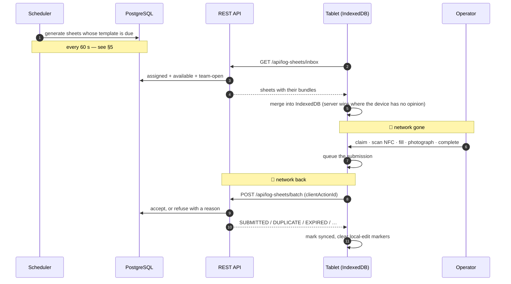

# System Architecture

Four tiers, one rule that shapes all of them: **an operator on a plant floor with no signal must
be able to do a full round.** Everything below either serves that or is constrained by it.

> This document is the map. The detail lives in the other files, and each section says where.
> When a component changes, the description here changes in the same commit — see
> [CLAUDE.md](../CLAUDE.md).

---

# 1. The whole picture

---

# 2. What each tier is for

## The tablet is a workspace, not a cache

The PWA holds its own database and works entirely from it. A round is filled, photographed,
NFC-scanned and completed with the network absent for the whole shift; the sync manager
reconciles afterwards.

Three things follow, and they explain most of the client's design:

- **Every screen reads IndexedDB, never the network.** A screen that awaits a fetch is a screen
  that is blank in a basement.
- **Reference data travels with the work.** A sheet's bundle carries the assets, the hierarchy
  slice and the *field definitions as they were when the sheet was generated* — a template edited
  afterwards must not change a form somebody is halfway through.
- **Writes are queued, not sent.** The outbound queue survives a reload and a battery pull, and
  every submit carries a `clientActionId` so replaying it is free.

Details: PWA [`docs/sync.md`](../../../FrontEnd/offline-first-pwa/docs/sync.md) and
[`docs/storage.md`](../../../FrontEnd/offline-first-pwa/docs/storage.md).

## nginx is the only thing the tablet talks to

It terminates TLS, serves the built PWA as static files, and proxies `/api/*` to Spring Boot on
loopback `:8081`. The backend never needs to bind 443 or run as root, and 8081 is not exposed on
the network at all.

The PWA calls **relative** `/api` paths for the same reason: same-origin means no CORS
preflight per request, no origin baked into the build, and one certificate.

Details: [`docs/deployment.md`](deployment.md) and the PWA's own deployment guide.

## Spring Boot is the system of record's gatekeeper

Four security filter chains, in order, because they authenticate four different kinds of caller:

| Order | Path | Credential | Principal |
|---|---|---|---|
| 0 | `/integration/**` | `X-API-Key` | no user at all — a key, scoped to read completed rounds |
| 1 | `/api/**` | Bearer JWT + a live `api_sessions` row | a user, resolved from the database on **every request** |
| 2 | panel | form login + HTTP session | a user, captured at login |
| — | `/actuator/health/*` | none | liveness and readiness probes only |

Authorization is by **permission**, never by role name — a duplicated role behaves exactly like
its original. Read [`docs/security.md`](security.md) before adding any endpoint.

## PostgreSQL is the system of record, and the disk holds the media

Everything authoritative is in the database. Attachments are the one exception: the *bytes* live
on disk under `app.attachments.storage-path` and the row that names them lives in the database,
because a 25 MB photo in a JSONB column is a query nobody can run twice.

Details: [`docs/schema.md`](schema.md).

---

# 3. How a round actually flows

The step that carries the most design is the merge. Per entry, the device keeps what **somebody
edited on it** and takes the server's for everything else — and "edited here" is recorded when
the edit happens (`locallyEditedAt`), because after any sync the device is holding the server's
own values and no question about the data can tell the two apart. Two earlier answers to that
question each lost real readings.

Details: [`docs/log-sheets.md`](log-sheets.md) §"Who wins when two people have touched the same
sheet", and gotchas #87, #88 and #90 in [AGENTS.md](../AGENTS.md).

---

# 4. The four runtime principles

## 4.1 Synchronization

| Phase | What it does |
|---|---|
| **Bootstrap pull** | session context: permissions, settings, the user's units |
| **Inbox pull** | assigned / available / team-open sheets, each with its bundle |
| **Outbound push** | queued submissions, attachments and NFC fault reports |

Runs on a 30-second timer **and** on the browser's `online` event. The server is authoritative
for everything the device has not edited.

## 4.2 Offline mode

Works with no network: the UI (from the service worker cache), all data (from IndexedDB),
filling, saving, NFC, camera and audio, and completing a sheet — which queues rather than sends.

Needs the network: logging in, claiming or being assigned a sheet, and delivering work.

## 4.3 Consistency and conflicts

- The server decides. A refused submit comes back with a reason the device can act on.
- Merging is **per entry, never per field** — two people editing different fields of the same
  asset is last-writer-wins, knowingly.
- `completedAt` is the **device's** completion time, not the server's receipt time. A round
  finished at 02:10 underground and delivered at 06:00 is a 02:10 round.
- `clientActionId` makes every submit idempotent, so a retry after a timeout cannot double-write.
- A stale device may not blank an answer it never saw (`wouldBlankUnseenAnswer`).

## 4.4 Access

Five system roles — ADMIN, HIGH_USER, SUPERVISOR, SENIOR_OPERATOR, OPERATOR — but **no rule keys
off a role's name.** Access is a set of permission rows, plus eleven `CAP:*` capabilities for the
rules that are not about an endpoint. On top of that, two scope axes decide *which rows* a
permission reaches.

Details: [`docs/security.md`](security.md), [`docs/hierarchy.md`](hierarchy.md).

---

# 5. Timing, and why things are not instant

Both log sheet generation and expiry run on a **60-second `fixedDelay`** timer. A sheet due at
10:30 is therefore noticed somewhere in the following minute — about 30 seconds later on average.
That lag is the polling interval, not a defect, and `fixedDelay` measures from the *end* of the
previous run so the phase drifts slightly rather than staying aligned to the clock.

Both intervals are configurable (`APP_SCHEDULER_LOG_SHEET_GEN_MS`,
`APP_SCHEDULER_LOG_SHEET_EXPIRY_MS`). Lowering them costs one indexed query per tick and shortens
the lag proportionally.

Details: [`docs/jobs.md`](jobs.md).

---

# 6. Identity across the boundary

Three identifiers travel between the tablet and the server, and they answer different questions.

| Identifier | Made by | Lives | Answers |
|---|---|---|---|
| `serverId` | server | `log_sheets.id` | which sheet is this, to everybody |
| `localId` | device (UUID) | IndexedDB only | which local row is this, before and independently of any server id |
| `clientActionId` | device (UUID) | both — unique in the DB | is this submission one I have already applied |

`localId` does three jobs on the device and one across the wire.

1. **It is the sheet's primary key in IndexedDB.** Every read and write goes through it —
   `getLogSheet(localId)`, `updateLogSheet(localId, …)`.
2. **It is the route parameter** the fill page opens a sheet by. Archived snapshots — a
   previous operator's submitted copy, kept on a shared tablet — are given a synthetic id in
   the same namespace (`archive:{serverId}:{userId}`), so one route opens both a live sheet
   and a read-only snapshot without a second screen.
3. **It is stable across the row's life.** A sheet reset to draft, reopened or reassigned keeps
   the same `localId`; it is `clientActionId` that is regenerated, because that one identifies
   a *submission* rather than a row.
4. **It is the correlation key in a batch submit.** The device sends it with each sheet and the
   server echoes it back in every `LogSheetSubmitResult`, so the client matches each outcome to
   the row that produced it — `new Map(pending.map(l => [l.localId, l]))` — instead of relying
   on the response preserving request order.

The server does not store it for log sheets: it is a round-trip token and nothing more. (It
*is* stored as `nfc_fault_reports.local_id`, which is the opposite case — those rows originate
on the device, so the id is worth keeping.)

`clientActionId` is the idempotency key and is `UNIQUE` in the database, which is what makes a
retried batch safe rather than merely unlikely to be replayed.

---

# 7. Where to read next

| Question | File |
|---|---|
| Every table, column and index, with the reasoning | [schema.md](schema.md) |
| Location → asset, and who can see what | [hierarchy.md](hierarchy.md) |
| Roles, permissions, the enforcement layers | [security.md](security.md) |
| The log sheet lifecycle and its endpoints | [log-sheets.md](log-sheets.md) |
| Schedulers, runners, async pools | [jobs.md](jobs.md) |
| Every report and the formula behind each number | [reports.md](reports.md) |
| Running it as a service, backups, certificates | [deployment.md](deployment.md) |
| Designs that are deliberately not built | [roadmap.md](roadmap.md) |
| Traps found by debugging | [AGENTS.md](../AGENTS.md) |
